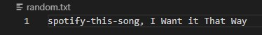

# LIRI - Like Siri **_only lazier_**
## By [Dan Smith](https://kentarosmith.github.io/)
This is a Node app that takes in requests and pulls information about music, movies, and concerts from several API's and returns them to the user.

### Node Packages:
* [axios](https://www.npmjs.com/package/axios)
* [dotenv](https://www.npmjs.com/package/dotenv)
* [moment](https://www.npmjs.com/package/moment)
* [node-spotify-api](https://www.npmjs.com/package/node-spotify-api)

### Web API's used:
* [Bands in town](https://manager.bandsintown.com/support/bandsintown-api)
* [Spotify](https://developer.spotify.com/documentation/web-api/)
* [OMDB](http://www.omdbapi.com/)
## How it works:

### Setup:
1. Make sure you have [Node](https://nodejs.org/en/) and [GitBash](https://gitforwindows.org/) installed.
2. Clone this repository
3. Install the Node Packages 
   3. Use the command 'npm install' in bash to ensure that the app has everything it needs to work

### Product Demo:
#### LIRI has four commands:
>concert-this 
- This command queries the bands in town web API via axios and returns the venues and dates of said concerts (formatted with moment.js in to MM/DD/YYYY format)

>spotify-this-song
- Entering a song title will query Spotify and return a list of songs matching that title, along with the artist's name, the album it appears on and a link to listen to it on Spotify's web player

>movie-this
- Using the OMDB API, entering this command will return the movie title, release year, ratings from IMDB and Rotten Tomatoes, as well as production info, a cast listing, and plot summary of whatever movie you type in!

>do-what-it-says
- This command will read the random.txt file in the repository and execute the command and search term entered in the file - provided that they are separated by a comma.

